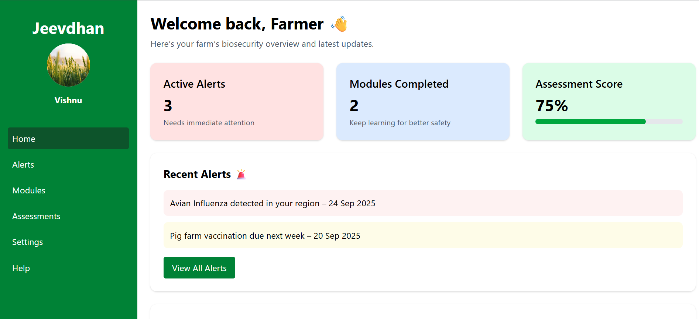

# Jeevdhan

A digital biosecurity platform for small and medium-scale livestock farms. Provides farmers with customizable risk assessments, compliance checklists, training modules, real-time alerts, and a dashboard to monitor and improve farm-level biosecurity.
---



---

[🌐 Live Demo](https://jeevdhan.vercel.app/)

---
## 🚀 Features of JeevDhan

### 👨‍🌾 Farmer Dashboard
- Real-time disease alerts & risk assessment  
- Compliance tracking with digital checklists & scorecards  
- Interactive training modules with localized content  
- Profile & farm settings management  

### 👨‍⚕️ Vet Dashboard
- View and monitor assigned farms  
- Access health check reports & upload recommendations  
- Schedule farm visits efficiently  
- Maintain vet profile and farm history  

### 🛠️ Admin Dashboard
- Create & manage alerts  
- Generate analytics and compliance reports  
- Oversee farm-level biosecurity data  
- Support disease surveillance at scale  

### ⚡ Core Platform Capabilities
- Multilingual & mobile-first design for rural accessibility  
- Offline-first support for low-connectivity regions  
- AI-driven risk assessment and predictive alerts  
- Secure cloud backend with scalable infrastructure  
- Data analytics for government & policy-making  


---

## Technologies Used

- **Frontend:** React, Tailwind CSS 
- **Backend:** Node.js, Express, Axios, Postman
- **Database:** MongoDB , Mongoose
- **Hosting:** Vercel (Frontend), MongoDB Atlas (Database)

---

## Installation

1. Clone the repository:

```bash
git clone https://github.com/srishtinsaan/jeevdhan.git
```

2. Navigate into the project directory:

```
cd jeevdhan
```
   
3. Install dependencies:

```
npm install
```
5. Start the development server:

```
npm start
```
